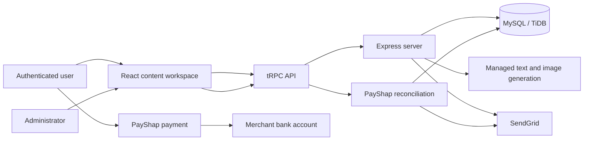

# Kamvai

**Kamvai** is a South African AI content studio for generating and refining blog posts, emails, code, and images. It combines an editorial workspace with saved drafts, multilingual user-interface scaffolding, browser voice input, server-enforced usage controls, privacy controls, and a manual PayShap payment workflow.

> **Production URL:** [kamvaiapp-x5nhzajm.manus.space](https://kamvaiapp-x5nhzajm.manus.space)

## What Kamvai does

Kamvai provides an authenticated creation workspace that lets a user describe the desired result, generate a draft, refine the output, preserve version history, and share content. The product is designed for a South African audience: it uses South African rand pricing, provides baseline language resources for all 11 official languages, and supports an interim PayShap-based subscription workflow.

| Area | Included capabilities |
|---|---|
| **AI workspace** | Blog, email, code, and image generation; Code supports predefined or custom technology-stack selection; iterative refinement; draft saving and revision history. |
| **Access control** | Server-side rolling 24-hour free allowance of **10 generations**; active weekly/monthly entitlements bypass the free cap. |
| **Payments** | Manual PayShap requests with an expiring, non-sequential payment reference; administrator-only reconciliation; pending-only access until confirmation. |
| **Identity** | Existing secure single sign-on plus email/password registration, hashed OTP verification, and email/password sign-in. |
| **Email** | SendGrid OTP delivery, PayShap payment-confirmation email, and account-deletion request acknowledgement. |
| **Privacy** | Explicit privacy-consent recording, account-deletion request and review flow, and no plaintext voucher-code persistence. |
| **Language and accessibility** | `react-i18next` setup, language selector, persisted theme preferences, light/dark/system modes, and voice-input fallbacks. |
| **Sharing** | Shareable text-draft previews with social metadata, copy-link support, and social-sharing actions. |

## Architecture

Kamvai is a React 19 and TypeScript application served by Express. Client-server communication uses type-safe tRPC procedures, while Drizzle ORM manages a MySQL/TiDB-compatible schema. The application uses the managed authentication, storage, and AI gateway services supplied by the hosting environment.



### Core project layout

| Path | Purpose |
|---|---|
| `client/src/pages/Home.tsx` | Main content-studio user interface, sharing, subscription, account, and privacy controls. |
| `client/src/i18n.ts` | Baseline language resources and i18n setup. |
| `client/src/contexts/ThemeContext.tsx` | Persisted light, dark, and system theme handling. |
| `server/routers.ts` | Root tRPC router. |
| `server/routers/` | Domain routers for generation, drafts, preferences, payments, email authentication, and privacy. |
| `server/db.ts` | Database helpers, allowance calculation, payment reconciliation, and persistence logic. |
| `server/sendgrid.ts` | OTP and transactional email sender with verified-sender checks. |
| `server/payShap.ts` | PayShap recipient-instruction contract and validation helper. |
| `server/sharePreview.ts` | Public draft-preview metadata rendering. |
| `drizzle/schema.ts` | Drizzle schema definitions. |
| `drizzle/*.sql` | Versioned database migrations. |
| `INTEGRATIONS.md` | Provider activation and operational-boundary guide. |
| `VALIDATION.md` | Automated and authenticated workspace validation record. |

## Data model

The schema includes the platform user table plus purpose-specific tables for content, access, privacy, and payments.

| Table | Responsibility |
|---|---|
| `users` | Identity, role, login profile, and session-related account metadata. |
| `email_auth_accounts` and `email_otp_challenges` | Password credentials and hashed, expiring, rate-limited email verification challenges. |
| `content_drafts` and `draft_revisions` | User-owned generated content and iterative refinement history. |
| `generation_usages` | Timestamped server-side usage records for the rolling allowance. |
| `entitlements` | Active weekly or monthly access periods. |
| `payshap_payment_requests` | Pending, confirmed, rejected, or expired manual PayShap requests. |
| `voucher_redemption_attempts` | Future voucher-adapter audit records containing only masked voucher values. |
| `user_preferences` | Theme, language, and privacy-consent settings. |
| `account_deletion_requests` | User account-deletion requests and administrator resolution state. |

## Main workflows

### Content generation and allowance enforcement

Generation requests are checked on the server before an AI model is invoked. A user must have accepted the active privacy terms, and free accounts may use only the configured rolling allowance. The timestamp normalizer accepts JavaScript `Date` values and MySQL timestamp strings before computing the allowance reset time.

Paid entitlements activate only after an administrator confirms a reconciled payment request. The client never decides whether a user has paid access.

### Manual PayShap payment flow

Kamvai intentionally uses a manual reconciliation model. A user chooses a weekly or monthly pass and receives a unique reference with a 72-hour expiry. The interface displays the configured recipient name and ShapID only when the merchant configuration is present. A payment request stays pending until an administrator matches the actual bank credit and reference, then confirms or rejects it.

> A screenshot, proof of payment, or possession of a reference **never** activates an entitlement by itself.

The recipient values are set with `PAYSHAP_SHAP_ID` and `PAYSHAP_RECIPIENT_NAME`. PayShap is available through participating South African banks; confirm the merchant’s receiving setup before accepting real customer payments.[1] [2]

### Email verification and notices

Email registration sends an OTP using a verified SendGrid sender and dynamic template. OTP codes are generated server-side, hashed before persistence, rate-limited, and expire after the configured window.

Payment confirmations and account-deletion acknowledgements use the same verified sender. These transactional sends are non-blocking: an entitlement confirmation or privacy request is preserved if the email provider is temporarily unavailable.

### Privacy and deletion requests

Users can record privacy consent and request account deletion from the workspace. An administrator can move a request through review and resolution states. This is an operational workflow, not a substitute for legal review: the merchant must finalise the privacy notice, retention schedule, and actual account-deletion procedure before public launch.

## Local development

### Prerequisites

Use a recent Node.js 22 installation and `pnpm`. A MySQL/TiDB-compatible `DATABASE_URL` is required for persistence. The managed project environment supplies the standard authentication and AI gateway variables.

```bash
pnpm install
pnpm dev
```

The development server is started by `server/_core/index.ts` and serves the React application through the Vite integration.

### Useful commands

| Command | Purpose |
|---|---|
| `pnpm dev` | Start the local development server. |
| `pnpm check` | Run TypeScript type checking. |
| `pnpm test` | Run the Vitest server and domain test suite. |
| `pnpm build` | Build the production client and server artifacts. |
| `pnpm format` | Apply Prettier formatting. |
| `pnpm drizzle-kit generate` | Generate a migration after changing `drizzle/schema.ts`. |

### Database migrations

When changing the schema, generate the migration, inspect the generated SQL, then apply it in the managed database environment. Use a single reviewed migration whenever practical, and do not store file bytes, full voucher codes, or secrets in database records.

```bash
pnpm drizzle-kit generate
# Review the newest file under drizzle/
```

## Environment and provider configuration

Do not commit secret values. Environment variables must be managed through the hosting project’s secret manager.

| Variable | Use |
|---|---|
| `DATABASE_URL` | MySQL/TiDB connection string. |
| `SENDGRID_API_KEY` | SendGrid server API credential. |
| `SENDGRID_FROM_EMAIL` | Verified sender address. |
| `SENDGRID_OTP_TEMPLATE_ID` | SendGrid dynamic-template identifier for the OTP message. |
| `PAYSHAP_SHAP_ID` | Merchant’s registered ShapID or linked recipient identifier. |
| `PAYSHAP_RECIPIENT_NAME` | Recipient/business name shown in the customer payment instructions. |
| `JWT_SECRET` | Session-token signing material supplied by the hosting environment. |
| `BUILT_IN_FORGE_API_URL` and `BUILT_IN_FORGE_API_KEY` | Managed server-side gateway for AI and platform services. |

## Testing and validation

The test suite covers authentication logout, allowance enforcement, date normalization, privacy query contracts, voucher masking, PayShap instruction states, SendGrid credentials and sender configuration, and protected tRPC procedures.

```bash
pnpm check
pnpm test
pnpm build
```

The latest documented run contains **19 passing tests**. See [`VALIDATION.md`](./VALIDATION.md) for the detailed validation record.

## Launch checklist

| Item | Status or required action |
|---|---|
| PayShap recipient details | Configured. Perform a small real reconciliation before accepting customer payments. |
| SendGrid OTP and notices | Configured. Run a production email-delivery acceptance test with the production sender/domain. |
| Google OAuth | Deferred until the merchant creates and supplies a Google OAuth client ID and secret. |
| Voucher gateway | Not active; manual PayShap is the selected payment route. Retain masked-voucher controls for a future licensed-provider integration. |
| POPIA operations | Complete the legal/privacy review and define deletion/retention operations before launch. |
| Translation quality | Complete native-speaker review of all production UI, email, and legal strings before claiming full language coverage. |

## Security considerations

Kamvai keeps payment, access, and privacy decisions on the server. The application masks voucher codes on first handling and never displays or persists a raw voucher code. It checks PayShap recipient configuration before exposing payment instructions, keeps payment requests pending until an administrator reconciles them, and enforces usage caps in server procedures rather than the browser.

OTP codes are not retained in plaintext. Email delivery failures do not roll back a confirmed payment entitlement or recorded deletion request, so the underlying business record remains reliable even if an email service is temporarily unavailable.

## Further documentation

Read [`INTEGRATIONS.md`](./INTEGRATIONS.md) for provider activation and merchant responsibilities, and [`VALIDATION.md`](./VALIDATION.md) for the latest test and workspace validation notes.

## References

[1]: https://www.payshap.co.za/ "PayShap"
[2]: https://www.standardbank.co.za/southafrica/business/products-and-services/ways-to-bank/innovative-payment-solution/payshap-for-business "PayShap for business"
